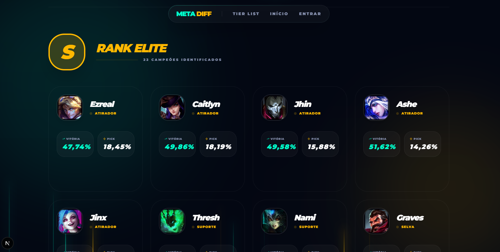
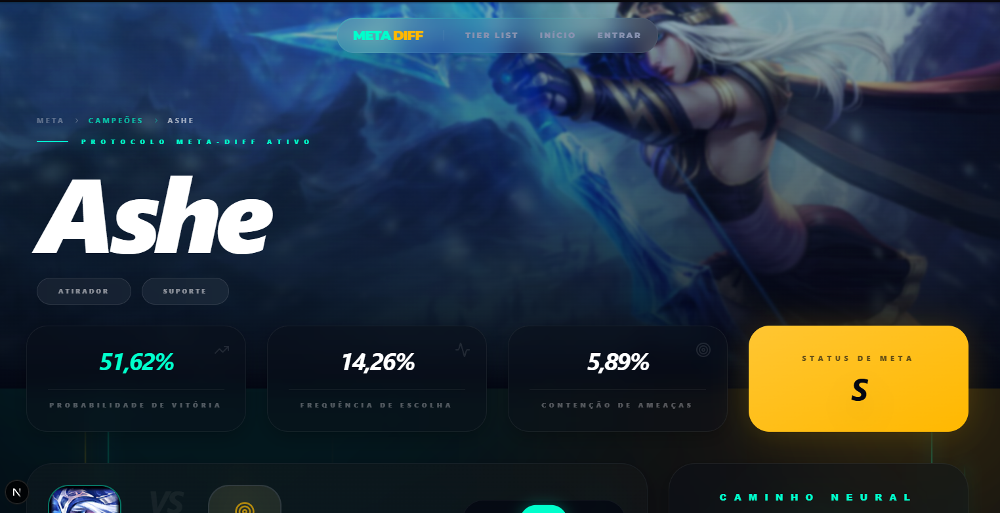

# 🚀 Meta Diff - Inteligência para o seu Meta

  
  
<h3>Estatísticas precisas, builds otimizadas e o meta do LoL em um único lugar.</h3>

   

  

    
  

  
  
<i>Acesse o projeto oficial e explore todas as funcionalidades em tempo real.</i>

---

## 📸 Experiência de Análise Completa

### 📊 Dashboard Estratégico
Acompanhe os principais indicadores de performance (KPIs) com uma interface visual limpa, moderna e focada em resultados rápidos.

  

 

### 🏆 Tier List & Champion Insights
Rankings detalhados por lane, Win Rate, Pick Rate e Tier. Tudo o que você precisa para dominar a SoloQ.

  
  

---

## ✨ Diferenciais do Ecossistema

- **Design Premium:** Interface moderna, intuitiva e totalmente responsiva para Mobile e Desktop.
- **Dados em Tempo Real:** Sincronização constante com as melhores fontes de dados de League of Legends.
- **Builds Otimizadas:** Protocolos ativos de builds, runas e ordens de habilidades baseados no meta atual.
- **Segurança Robusta:** Autenticação e proteção de dados via Supabase.

---

## 🛠️ Stack Tecnológica

O **Meta Diff** utiliza o que há de mais moderno no desenvolvimento web para garantir performance e escalabilidade:

- **Frontend:** Next.js 16 (App Router)
- **Backend & Auth:** Supabase
- **Estilização:** Tailwind CSS v4 & Vanilla CSS
- **Iconografia:** Lucide React

---

## 📧 Contato Comercial & Desenvolvedor

**Carlos André** — *Especialista em Soluções SaaS*  

  
© 2026 Meta Diff • Tecnologia para Gamers

